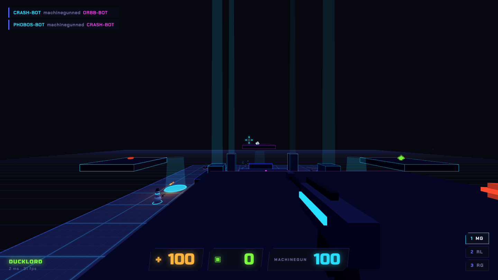
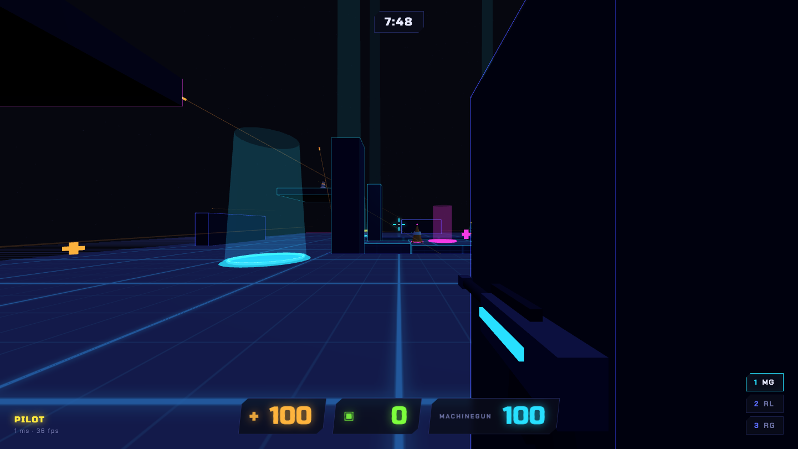
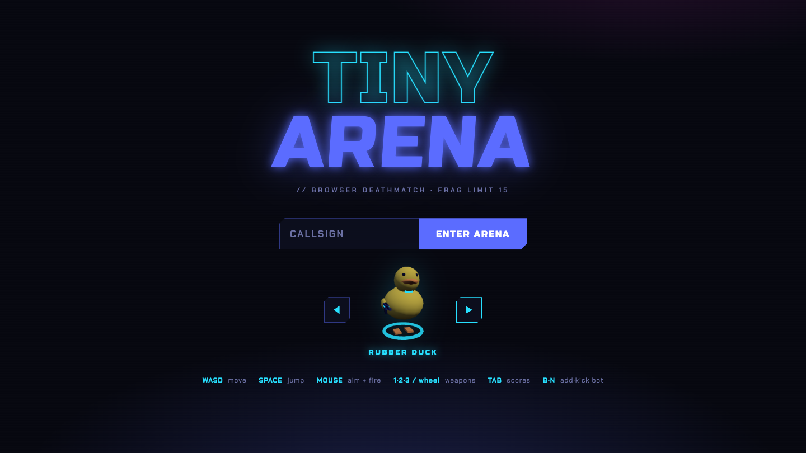
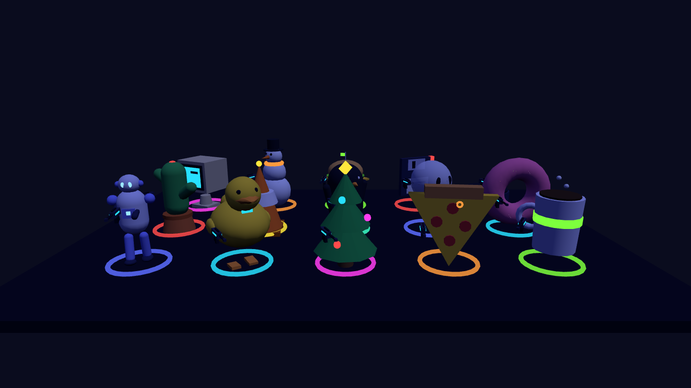
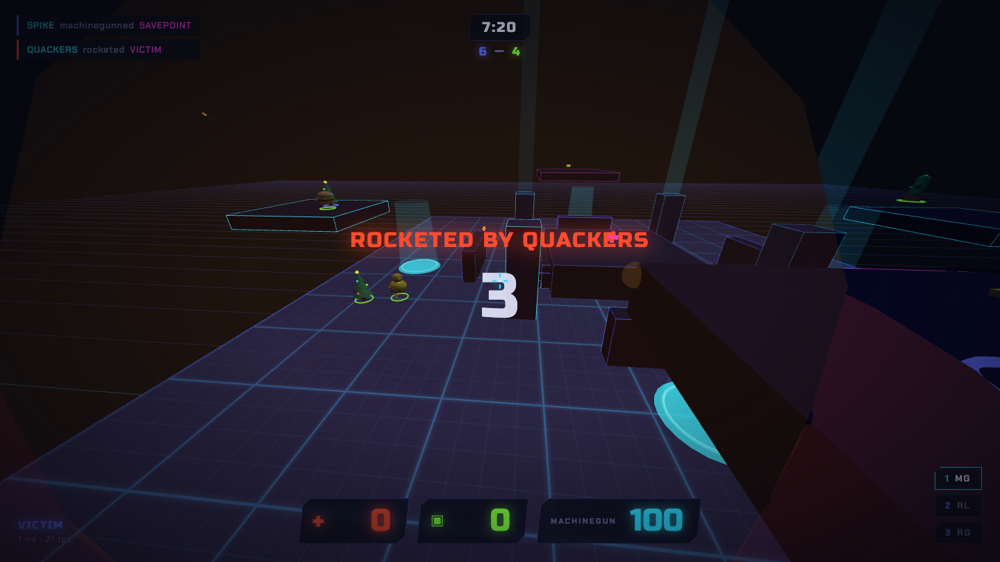

# TINY ARENA

Quake-style browser deathmatch in one 10 MB Go binary. The server, the bots, and the whole Tron-flavored Three.js client are baked into a single executable, so there is nothing to build and nothing for players to install.

**Play it live: [tinyarena.online](https://tinyarena.online)** — the bots are waiting.



## Run

```sh
go build -o tiny-arena-server . && ./tiny-arena-server
# open http://localhost:3377
```

Or without Go, straight from the registry:

```sh
docker run -p 3377:3377 ghcr.io/tpoxa/tinyarena
```

Colleagues on the same network: give them `http://<your-lan-ip>:3377`. That's the whole deployment story.

Env: `PORT` (default 3377), `BOTS` (default 3), `MAP` (`neon-yard` or `circuit`), `MATCH_SECONDS` (default 480), `DEV=1` serves `public/` and `shared/` from disk so client edits apply on refresh.

Two maps ship in the binary. `neon-yard` is the classic yard with side platforms. `circuit` is a ring around a void pit: a mega-health island in the middle reached by two narrow bridges, four corner platforms fed by diagonal jump pads, and a teleporter out of the island when it gets too warm.



## Play

Pick a body at the join screen — rubber duck, pizza slice, Christmas tree, retro PC, and eleven more low-poly desk heroes. Bots pick their own.




- **WASD** + mouse, **SPACE** jump (hold it for auto-hop)
- **1/2/3** or wheel — machinegun / rocket launcher / railgun
- **TAB** scoreboard, **B** add a bot, **N** kick the newest one (max 8)
- Rocket-jump: fire at your feet mid-jump. Knockback is real: rockets throw people, sometimes off the map. The void keeps score.
- **QUAD DAMAGE** spawns on the east platform every 60 s: 3× damage for 20 s, lost on death, and everyone gets told you have it
- Fast frags stack DOUBLE / TRIPLE / MULTI / MONSTER KILL; staying alive stacks KILLING SPREE (5), RAMPAGE (8), GODLIKE (12)
- Death matters: the camera pulls out behind you while your body bursts into cubes that ride the killing blow
- Matches run on a clock (8 minutes by default): first to 15 frags wins, or the leader when time runs out — either way you get the standings before the next round starts
- Bots ride the jump pads too, so the high ground is never safe for long
- Bots are named after their bodies: when QUACKERS rockets you off the map, that was the rubber duck. Watch out for FROSTY, SLICE, BOO, DUSTER, and the rest of the cast



Aim at someone to see their name. Yours is on the HUD.

## How it works

The Go server owns the truth. It runs the simulation at 30 Hz and sends snapshots at 20 Hz, all as plain JSON WebSocket messages you can read with `wscat`. Movement is client-predicted (Quake-style ground friction, air control, bunny-hop), but every shot is validated and resolved server-side: hitscan and rockets ray-march against player spheres and the map's AABBs, so a laggy client can't invent hits. Remote players render about 120 ms in the past and interpolate between snapshots.

- `main.go` — WebSocket plumbing; one goroutine owns all game state, connections talk to it via channels
- `game.go` — combat, pickups, streaks, quad, snapshots
- `bots.go` — bots walk a line-of-sight waypoint graph (layer-aware, with walkability checks so nobody strolls into a void pit), ride jump pads up to the platforms, and switch to pure server-side ballistics when a rocket sends them flying
- `arena.go` — map loading + AABB raycasts
- `shared/maps/*.json` — each map is one JSON file (geometry, weapons, balance, nav graph) read by both Go and JS; the server serves the active one to the browser
- `public/` — the client: Three.js scene, prediction, HUD, procedural WebAudio sound (zero asset files), and the model factory (`public/js/models.js`)

The player bodies are built from Three.js primitives at runtime; there are no model files in the repo. Sounds work the same way: every effect is synthesized from oscillators and filtered noise. The only vendored dependency is Three.js.

## Tests

```sh
PORT=3388 BOTS=0 ./tiny-arena-server &   # protocol smoke test needs a bot-free server
node server/smoke.js
```

`server/smoke.js` drives two WebSocket clients through join → shoot → frag → respawn against a real server.

## How tinyarena.online runs

Every push to `main` builds a distroless image (with the smoke test as a gate), tags it `main-<sha>-<timestamp>`, and pushes it to ghcr. FluxCD on a GKE cluster watches the registry, bumps the tag in its GitOps repo, and rolls the deployment — single replica with a `Recreate` strategy, because the game world lives in one process's memory. cert-manager handles TLS, and nginx-ingress proxies the websockets. Nobody deploys anything by hand.

## Made with Claude Code

This game was designed, written, debugged, and screenshot-tested by [Claude Code](https://claude.com/claude-code) across a handful of sessions, steered by one human with opinions about how rocket jumps should feel. The bugs were also written by Claude Code, to be fair. Then found and fixed by it, using headless-browser screenshots and WebSocket protocol tests it wrote for itself.

## License

MIT — see [LICENSE](LICENSE).
